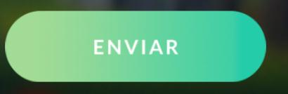
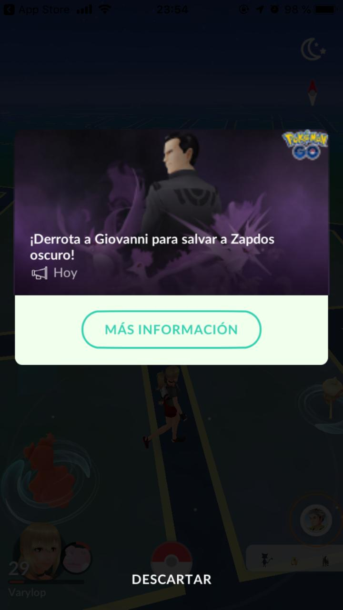
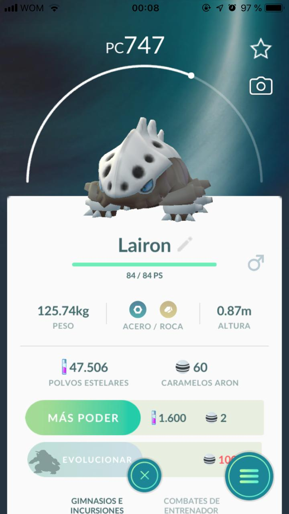
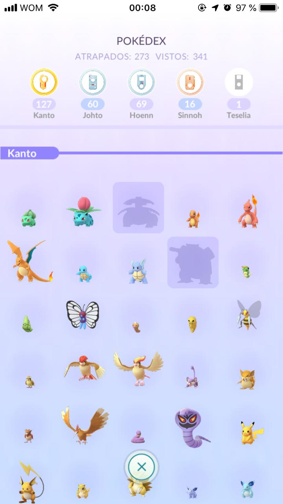

# Índice

# 1. Presentación

## ¿Qué es Pokémon GO?

Pokémon GO es un videojuego de realidad aumentada basado en la localización desarrollado por **Niantic**, Inc. para dispositivos iOS y Android. Es un videojuego gratuito pero contiene microtransacciones.​ El juego consiste en buscar y capturar personajes de la saga Pokémon escondidos en ubicaciones del mundo real y luchar con ellos, lo que implica desplazarse físicamente por las calles de la ciudad para progresar. La aplicación comporta un elemento de interacción social, ya que promueve reuniones físicas de los usuarios en distintas ubicaciones de sus poblaciones.

## ¿Qué es Poképedia GO?

Poképedia es una **ayuda** para cualquier jugador de Pokémon GO,
aquí podrás encontrar muchas cosas necesaria para poder ser el mejor maestro Pokémon. 

Para el equipo de Pokepedia Go es importante hacer que tu experiencia como jugador sea más entretenida, nos encargaremos de darte tips y pistas para poder descubrir el Pokémon que quieres atrapar, también puedes saber las debilidades de los pokémon de tu contrincante y muchas cosas más.

Para poder utilizar esta aplicación debes tener una cuenta registrada en el juego y tener un minímo de experiencia capturando tus pokémons.

Explora la página y ¡descubre!

# 2. Resumen del proyecto

Para este proyecto vivimos la experencía de crear una página web desde cero, logrando visualizar un conjunto de datos que se adecúe a lo que nuestros usuarios necesitan.

 En nuestra página el usuario podrá:

 - Visualizar 
 - Filtrar 
 - Ordenar

# 3. Historias Usuarios

Poképedia es la idea que trabajamos en conjunto para el proyecto DataLover donde construimos una página web basándonos en historias de usuarios.

Dentro de los diferentes temas que nos entregaba la data, decidimos seleccionar Pokémon GO, ya que pensamos que sería algo interesante en abordar y ambas poseíamos experencia en el juego.

### Creando nuestras Historias de Usuario

En esta ocasión se nos pidio crear tres historias de usuario las que serían claves para la creación de nuestra página, basandonos en nuestras propias experiencias con Pokemon GO, creamos tres historias de usuarios donde lo primordial estaba en **derrotar gimnasios y al equipo rocket** (Evento de Pokemon Go implementado este año).-

### **1era Historia de Usuario**

Yo COMO usuaria QUISIERA saber que pokémon hay de cada tipo PARA tener mayor variedad en mi colección.

### **2da Historia de Usuario** 

Yo COMO usuaria de la app QUISIERA saber cuáles Pokémons son débiles ante mi Pokémon PARA poder derrotarlos.

### **3era Historia de Usuario** 

Yo COMO usuaria QUISIERA saber cuándo es más probable que salga cierto pokémon PARA atraparlo.

Tomando estas historias, comenzamos con el diseño de la página.

# 4. Organización del Proyecto

Para este extenso proyecto el equipo Poképedia se organizo por metas diarias, donde nuestros objetivos principales eran alcanzar a realizar o modificar algún aspecto de nuestra página, ya sea, crear los prototipos, crear HTML, CSS o Javascript, para todo esto nos ayudamos con [Trello](https://trello.com/b/RDfmAMNS/pok%C3%A9mon-go-wiki).

# 5. Desarrollo de página web

Para lograr visualizar la app comenzamos con ver cuales eran nuestro conocimientos previos sobre el proyecto los cuales eran:

Teniendo estas ideas claras comenzamos a investigar más a fondo sobre Pokémon Go, observamos los colores de las página, animaciones, diseños, estilo de los pokémon, etc.

# 5.1 Prototipo de baja fidelidad

Primeros bocetos creados usando papel y lápiz. 

*IMAGENES*

Prototipo de alta fidelidad
 Interfaz de Usuario Figma.

# 5.2 Prototipo de alta fidelidad

Consultando y testeando nuestro prototipo de baja fidelidad a diferentes personas que habían utilizado Pokémon GO comenzamos a visualizar como podría ser nuestra aplicación.

Primordialmente no queriamos que al momento de que el jugador se introdujera en Poképedia se sintiera en un lugar desconocido y dudara de nuestra aplicación, es por eso que decidimos basar nuestro diseño en algunos conceptos ya creados en Pokémon GO, como los colores, formas, tipografias, etc, pero con diferencias ya que tampoco deseamos que nuestra aplicación sea una copia de Pokémon GO.

# 5.3 Pokémon GO

# 5.4 Diseño Visual

Tomando todo lo anterior mencionado, comenzamos a forma nuestro ideas sobre que deberia contener nuestro diseño:

# 5.5 1er Figma, prototipo de alta fidelidad.

Testeos de usabilidad

Durante el reto deberás hacer tests de usabilidad con distintos usuarios, y en base a los resultados, deberás iterar tus diseños. Cuéntanos qué problemas de usabilidad detectaste a través de los tests y cómo los mejoraste en tu propuesta final.

El equipo Poképedia se organizo atravez de Trello, lugar que ambas colaboradoras visitabamos

Basamos nuestro diseño de página observando la aplicación de Pokemon Go, queriamos que cuando el usuario navege en nuestra aplicacioón le recuerde a Pokemon Go.  

¿Quiénes son los principales usuarios de producto?

¿Cuáles son los objetivos de estos usuarios en relación con el producto?

¿Cuáles son los datos más relevantes que quieren ver en la interfaz y por qué?

¿Cuándo utilizan o utilizarían el producto?

Toda tu investigación previa debe tener como resultado todas las Historias de Usuario de tu proyecto.

No hagas los prototipos de alta fidelidad de todas tus Historias. 

Comienza solamente por los que se necesiten para tu Sprint 1 (semana 1 de trabajo). Más pistas en la guía de organización para el proyecto.