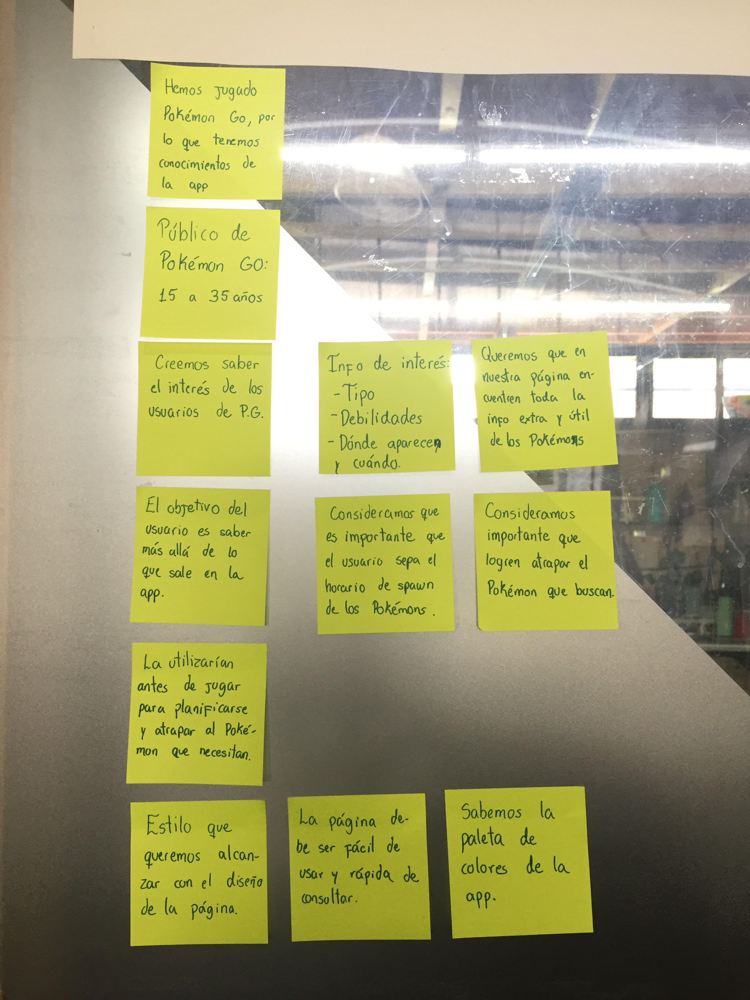
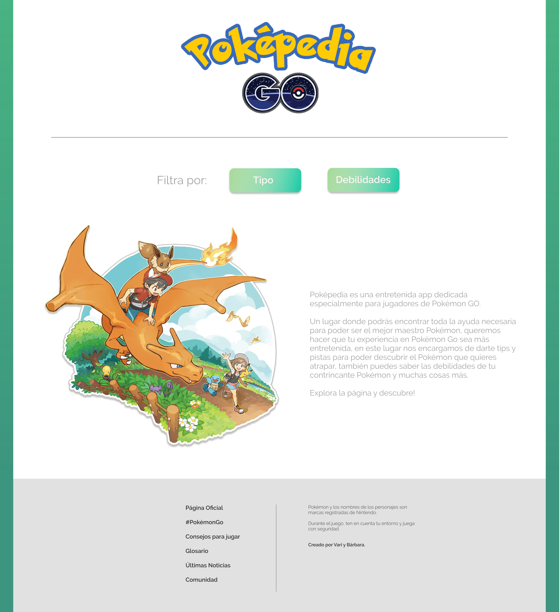
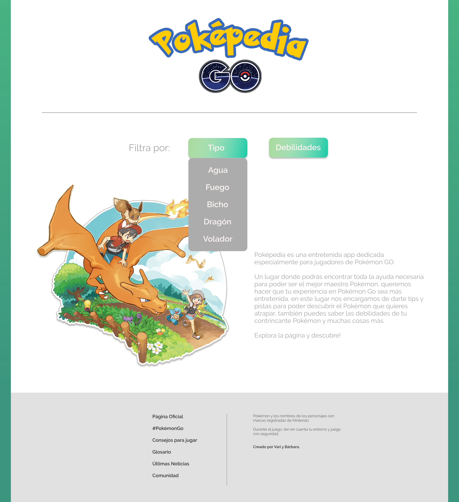
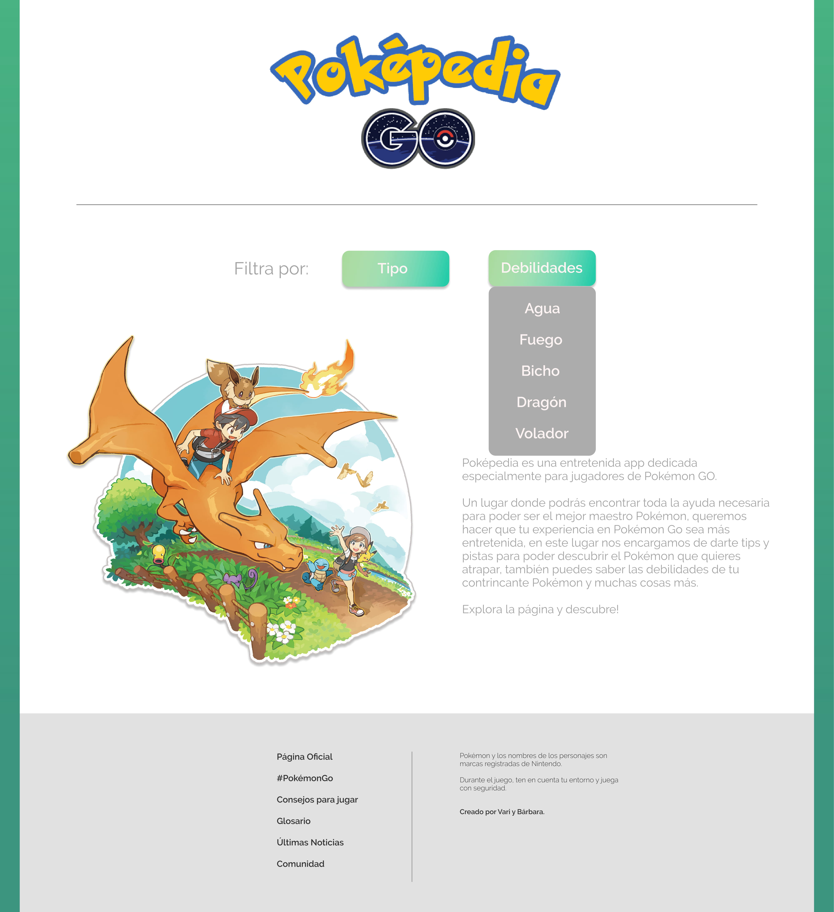
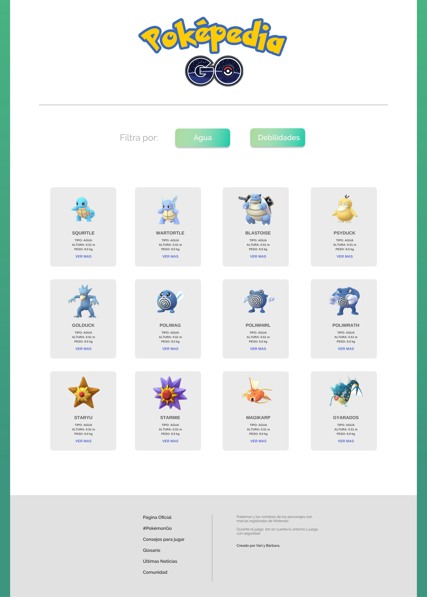
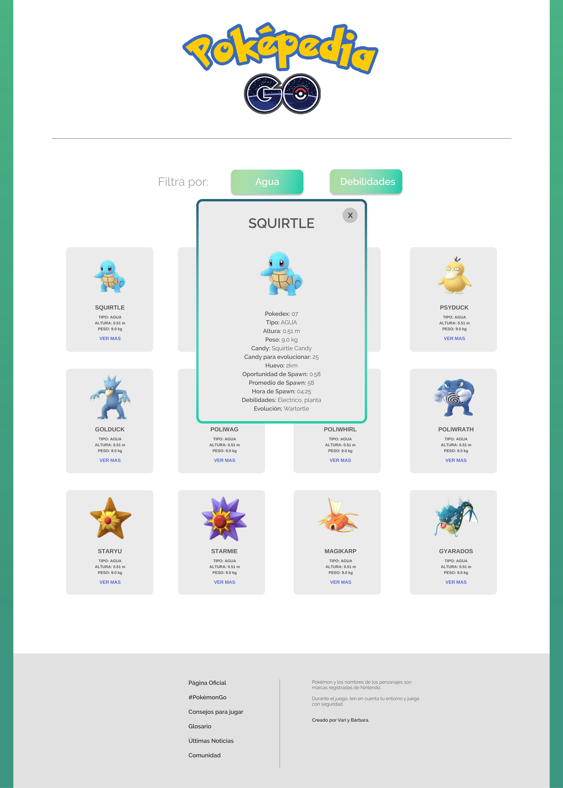
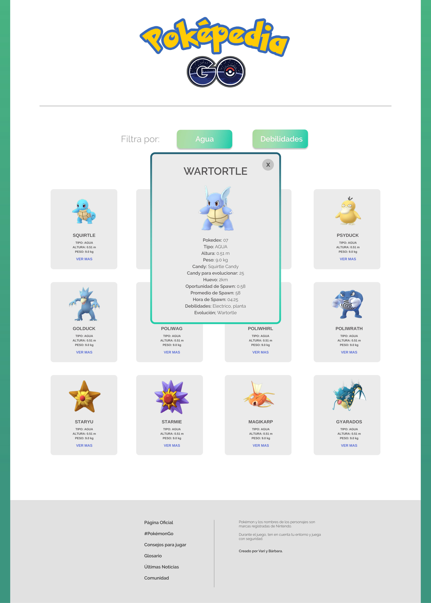

## Índice


## 1. Presentación

Poképedia es una entretenida app dedicada especialmente para jugadores de Pokémon GO. 

Un lugar donde podrás encontrar toda la ayuda necesaria para poder ser el mejor maestro Pokémon, queremos hacer que tu experiencia en Pokémon Go sea más entretenida, aquí nos encargamos de darte tips y pistas para poder descubrir el Pokémon que quieres atrapar, también puedes saber las debilidades de tu contrincante y muchas cosas más.

Explora la página y descubre!

## 2. Resumen del proyecto

Poképedia es el proyecto DataLover donde construimos una página web basandonos en lo que nuestras historias de usuario solicitaban. 

Dentro de los diferentes temas que nos entregaron, decidimos seleccionar Pokémon GO, basamos nuestro diseño de página en le aplicacion del tema y como objetivo principal, dentro de esta app el usuario podrá ver lo que desee filtrar, puede ser diferentes temas tales como: 

- Filtrar por tipo de Pokémon
- Filtrar por habilidades
- Buscar por nombre del Pokémon
- Saber mas información del Pokémon seleccionado

Para lograr eso llamamos a la data que se nos entrego y la adecuamos a las solicitudes de nuestras historias de usuarios.

-------

¿Quiénes son los principales usuarios de producto?

¿Cuáles son los objetivos de estos usuarios en relación con el producto?

¿Cuáles son los datos más relevantes que quieren ver en la interfaz y por qué?

¿Cuándo utilizan o utilizarían el producto?

Toda tu investigación previa debe tener como resultado todas las Historias de Usuario de tu proyecto.

No hagas los prototipos de alta fidelidad de todas tus Historias. 

Comienza solamente por los que se necesiten para tu Sprint 1 (semana 1 de trabajo). Más pistas en la guía de organización para el proyecto.

## Organización del Proyecto

Para este extenso proyecto nos organizamos por metas diarias, donde nuestros objetivos normalmente eran alcanzar a realizar o modificar algún aspecto de nuestra página, ya sea, crear los prototipos, crear HTML, CSS o Javascript, para todo esto nos ayudamos con [Trello](https://trello.com/b/RDfmAMNS/pok%C3%A9mon-go-wiki).


## Conocimientos previos

Para lograr visualizar la app comenzamos con ver cuales eran nuestro conocimientos previos sobre el proyecto que nos había dado, los cuales eran:




Luego creamos una historia de usuario de la cual nos guiamos para tener un objetivo y proponernos metas.


## Historia de Usuario 1

```
Yo COMO usuaria de la app QUISIERA saber las debilidades de cada pokémon PARA poder derrotarlos.

```
Creamos esta historia de usuario basandonos en nuestras propias experiencias con el juego y analizando lo que nos entregaba la data de Pokemon Go.

Diseño de la Interfaz de Usuario
Prototipo de baja fidelidad
Primeros bocetos creados usando papel y lápiz. 

*IMAGENES*

Prototipo de alta fidelidad
 Interfaz de Usuario Figma.









-------------------------------------------


El diseño debe representar el ideal de tu solución. Digamos que es lo que desearías implementar si tuvieras tiempo ilimitado para trabajar. Además, tu diseño debe seguir los fundamentos de visual design.


Testeos de usabilidad

Durante el reto deberás hacer tests de usabilidad con distintos usuarios, y en base a los resultados, deberás iterar tus diseños. Cuéntanos qué problemas de usabilidad detectaste a través de los tests y cómo los mejoraste en tu propuesta final.
