# Índice

* [1. Presentación](#1-presentación)
* [2. Resumen del proyecto](#2-resumen)
* [3. 3. Historias Usuarios](#3-historias)
* [4. Organización del Proyecto](#4-Organización)
* [5. Desarrollo de página web](#5-Desarrollo)
* [6. 1er Figma, prototipo de alta fidelidad.](#6-1erFigma)
* [7. 1er Testeo de usabilidad](#7-1erTesteo)
* [8. 2do Figma, prototipo de alta fidelidad.](#8-2doFigma)
* [9. 2do Testeo de usabilidad](#9-2doTesteo)
* [10.3er Testeo de usabilidad, página final.](#10-3erTesteo)
* [11. Finalizando.](#11-Finalizando)

# 1. Presentación

## ¿Qué es Pokémon GO?

Pokémon GO es un videojuego de realidad aumentada basado en la localización desarrollado por **Niantic**, Inc. para dispositivos iOS y Android. Es un videojuego gratuito pero contiene microtransacciones.​ El juego consiste en buscar y capturar personajes de la saga Pokémon escondidos en ubicaciones del mundo real y luchar con ellos, lo que implica desplazarse físicamente por las calles de la ciudad para progresar. La aplicación comporta un elemento de interacción social, ya que promueve reuniones físicas de los usuarios en distintas ubicaciones de sus poblaciones.

## ¿Qué es Poképedia GO?

Poképedia es una **ayuda** para cualquier jugador de Pokémon GO,
aquí podrás encontrar muchas cosas necesaria para poder ser el mejor maestro Pokémon. 

Para el equipo de Pokepedia Go es importante hacer que tu experiencia como jugador sea más entretenida, nos encargaremos de darte tips y pistas para poder descubrir el Pokémon que quieres atrapar, también puedes saber las debilidades de los pokémon de tu contrincante y muchas cosas más.

Para poder utilizar esta aplicación debes tener una cuenta registrada en el juego y tener un mínimo de experiencia capturando tus pokémons.

Explora la página y ¡descubre!

# 2. Resumen del proyecto

Para este proyecto vivimos la experiencia de crear una página web desde cero, logrando visualizar un conjunto de datos que se adecúe a lo que nuestros usuarios necesitan.

 En nuestra página el usuario podrá:

 - Visualizar 
 - Filtrar 
 - Ordenar

# 3. Historias Usuarios

Poképedia es la idea que trabajamos en conjunto para el proyecto DataLover donde construimos una página web basándonos en historias de usuarios.

Dentro de los diferentes temas que nos entregaba la data, decidimos seleccionar Pokémon GO, ya que pensamos que sería algo interesante en abordar y ambas poseíamos experencia en el juego.

### Creando nuestras Historias de Usuario

En esta ocasión se nos pidio crear tres historias de usuario las que serían claves para la creación de nuestra página, basándonos en nuestras propias experiencias con Pokémon GO, creamos tres historias de usuarios donde lo primordial estaba en **derrotar gimnasios y al equipo rocket** (Evento de Pokémon Go implementado este año).-

### **1era Historia de Usuario**

Yo COMO usuaria QUISIERA saber qué Pokémon hay de cada tipo PARA tener mayor variedad en mi colección.

### **2da Historia de Usuario** 

Yo COMO usuaria de la app QUISIERA saber cuáles Pokémons son débiles ante mi Pokémon PARA poder derrotarlos.

### **3era Historia de Usuario** 

Yo COMO usuaria QUISIERA saber cuándo es más probable que salga cierto Pokémon PARA atraparlo.

Tomando estas historias, comenzamos con el diseño de la página.

# 4. Organización del Proyecto

Para este extenso proyecto el equipo Poképedia se organizó por metas diarias, donde nuestros objetivos principales eran alcanzar a realizar o modificar algún aspecto de nuestra página, ya sea, crear los prototipos, crear HTML, CSS o Javascript, para todo esto nos ayudamos con [Trello](https://trello.com/b/RDfmAMNS/pok%C3%A9mon-go-wiki).

# 5. Desarrollo de página web

Para lograr visualizar la app comenzamos con ver cuáles eran nuestro conocimientos previos sobre el proyecto los cuales eran:

Teniendo estas ideas claras comenzamos a investigar más a fondo sobre Pokémon Go, observamos los colores de las página, animaciones, diseños, estilo de los Pokémon, etc.

# 5.1 Prototipo de baja fidelidad

Primeros bocetos creados usando papel y lápiz. 

# 5.2 Prototipo de alta fidelidad

Consultando y testeando nuestro prototipo de baja fidelidad a diferentes personas que habían utilizado Pokémon GO comenzamos a visualizar como podría ser nuestra aplicación.

Primordialmente no queríamos que al momento que el jugador se introdujera en Poképedia se sintiera en un lugar desconocido y dudara de nuestra aplicación, es por eso que decidimos basar nuestro diseño en algunos conceptos ya creados en Pokémon GO, como los colores, formas, tipografias, etc, pero con diferencias ya que tampoco deseamos que nuestra aplicación sea una copia de Pokémon GO.

# 5.3 Pokémon GO

# 5.4 Diseño Visual

Tomando todo lo anterior mencionado, comenzamos a formar nuestras ideas sobre qué debería contener nuestro diseño:

# 6. 1er Figma, prototipo de alta fidelidad.

De esta forma creamos nuestro primer prototipo para poder hacer nuestros testeos.

## Version Android

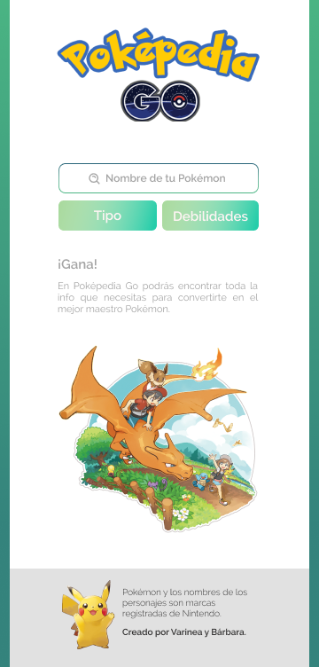
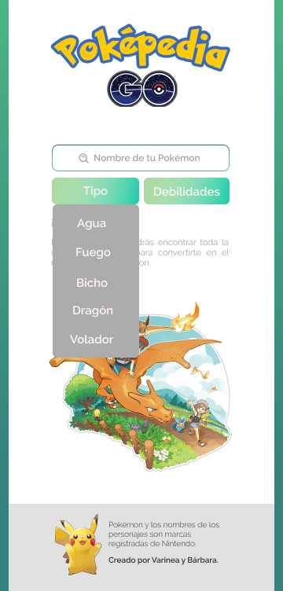
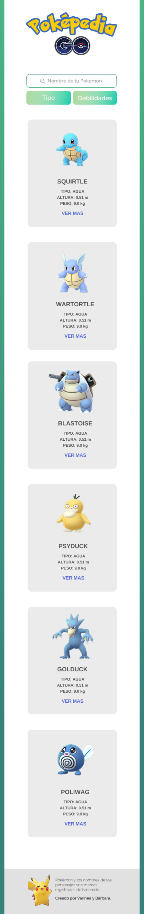
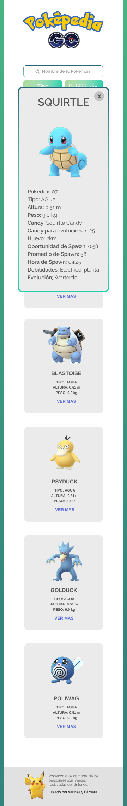

# 7. 1er Testeo de usabilidad

(https://www.loom.com/share/616eb11f84d949918cab348f4f4b70e9)

> Usuario : Gustavo Lopez

- Edad: 21 años
- Ocupación: Estudiante
- Hobbie: Gamer

## Feedback:

### Lo malo

> Seleccionado el pokémon la página no le devuelva a HOME.

> Demasiada información, el usuario no la leera.

> Que no tenga que presionar "ver mas" en las card de los pokémons.

> El principio de la página es aburrido.

> Que hayan pokémones legendarios

> Horarios de salidas de los pokémon

### Lo bueno

> Le agrada el diseño.

> Siente que la página es entendible.

> Facil de usar

> Logra el objetivo que se le da.

> Problema principal es con Figma.

# 8. 2do Figma, prototipo de alta fidelidad.

## Version Android

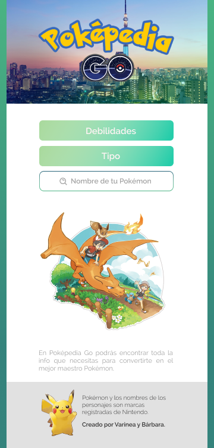
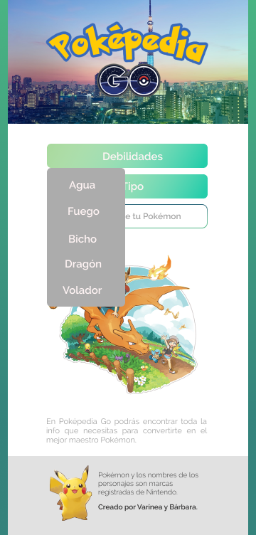
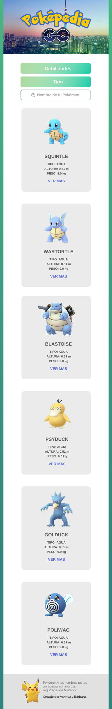
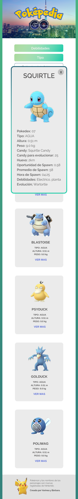

# 9. 2do Testeo de usabilidad

(https://www.loom.com/share/cb75b61a9969467c89f9a57421cbc3f5)

(https://www.loom.com/share/6a706b772a2443d8a98ce011befe1f6f)

> Usuario : Gustavo Lopez

- Edad: 21 años
- Ocupación: Estudiante
- Hobbie: Gamer

> Usuario : Maryelis

- Edad: 32 años
- Ocupación: Estudiante

## Feedback:

### Lo malo

> Seleccionado el Pokémon la página no le devuelva a HOME.

Error que produce Figma al momentos de seleccionar, se puede solucionar al momento de crear la página oficial.

> Más información de los Pokémons.

> Que no se salga de la sección en la que estaba al momento de seleccionar una card pokémon

### Lo bueno

> Le agrada el diseño.

> Cumplió con ambos usuarios la tarea asignada por entrevistador.

> El banner es un buen diseño, pues les hace pensar que deben ir a la ciudad o recorrer para atrapar pokémons.

> Usuario menciona que sí le ayudaría usar esta aplicación en el juego.

> Es intuitiva.

# 10. 3er Testeo de usabilidad, página final.

(https://www.loom.com/share/616eb11f84d949918cab348f4f4b70e9)

> Usuario : Gustavo Lopez.

- Edad: 21 años.
- Ocupación: Estudiante.
- Hobbie: Gamer.

## Feedback:

### Lo malo

> Un único error que fue que no estaban centrados los textos.

### Lo bueno

> Le gusta que haya podido usar el buscador.

> Este usuario SÍ usaría la página para poder derrotar al pokémon del adversario.

> Se solucionó el problema con Figma.

> La página es intuitiva.

## Página Final.

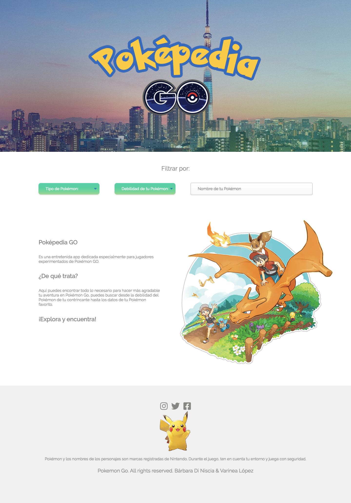
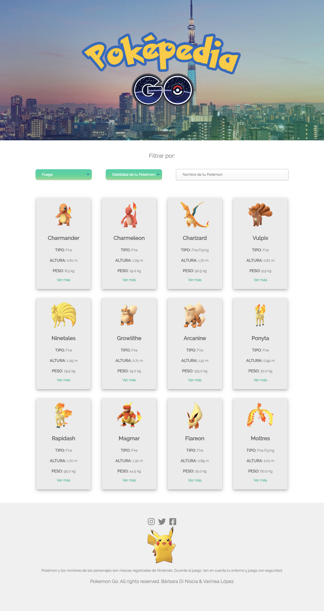
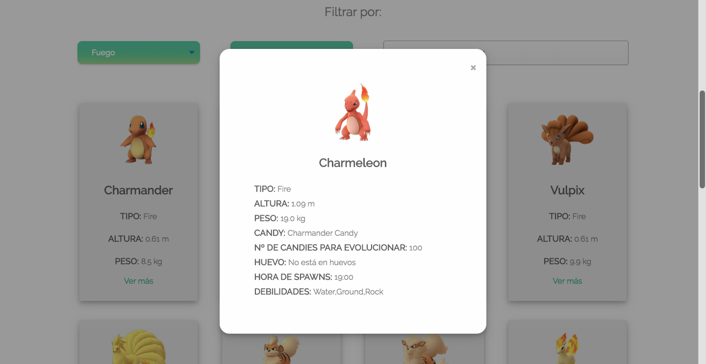
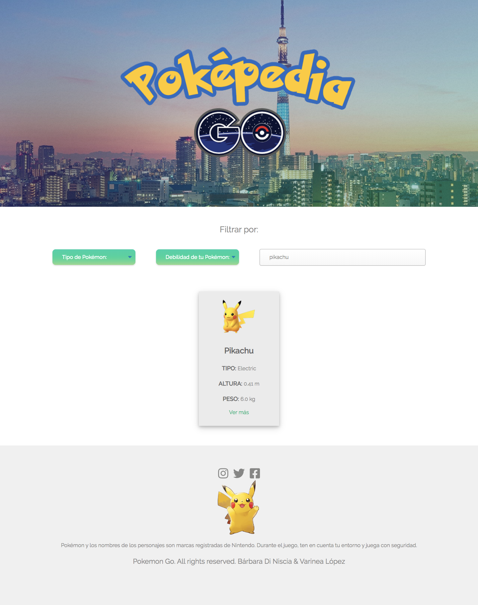

> Link para poder conocer nuestra aplicación.

[PokePedia Go!](https://varinea.github.io/SCL012-data-lovers/src/index.html)

# 11. Finalizando.

En resumen se lograron las historias de usuario pues están en la página aplicadas.

La página resulto tener los objetivos claros, es intuitiva y de fácil uso, un jugador de Pokémon Go sí usaría la página al momento de estar peleando en un gimnasio o con el equipo Rocket, ya que se le facilita el seleccionar un Pokemon que debilite al contrincante.

Durante el proceso de creación fue bastante motivador y entretenido ir explorando todo lo que se nos solicitó
 - HTML
 - CSS
 - JavaScript
 - Acceder a una data.

Para llegar a todo esto pasamos por dificultades al momento de no saber como llamar la data, no saber utilizar bien CSS, descubrir nuevas propiedades de JavaScript, problemas al subir la página a un servidor, usar flexbox, HTML semántico y un sin fin de tropiezos, los cuales en equipo pudimos lograr superar.

### ¿Qué nos hubiera gustado agregar?

Como equipo pensamos en varias cosas para la página, pero a medida que intentabamos aplicarlas se nos dificultaba más el código y decidimos priorizar nuestras historias de usuario.

Estas son algunas cosas que no logramos colocar en la página:

> Implementar sugerencias en el buscador cuando el usuario quisiera encontrar un Pokémon de forma rápida.

> Agregar evoluciones previas y próximas a los pokémon en el modal.

> No logramos colocar las barras de colores al costado de la página, solo quedo la idea en Figma.

> Colocar el diseño exacto que teniamos en Figma en el modal.

> Efecto especial en el modal cuando el usuario las seleccionara.

Aún con los retos que tuvimos, logramos crear una página web funcional, que realmente le sirve a los jugadore de Pokémon GO. Estas tres semanas fueron arduas, pero también sentimos que fue una gran instancia donde aprendimos muchas cosas y sobre todo nos dimos cuenta que sí podíamos lograr nuestros objetivos.

Muchas gracias por leer el readme de Poképedia Go.

## Atrápalos YA!

